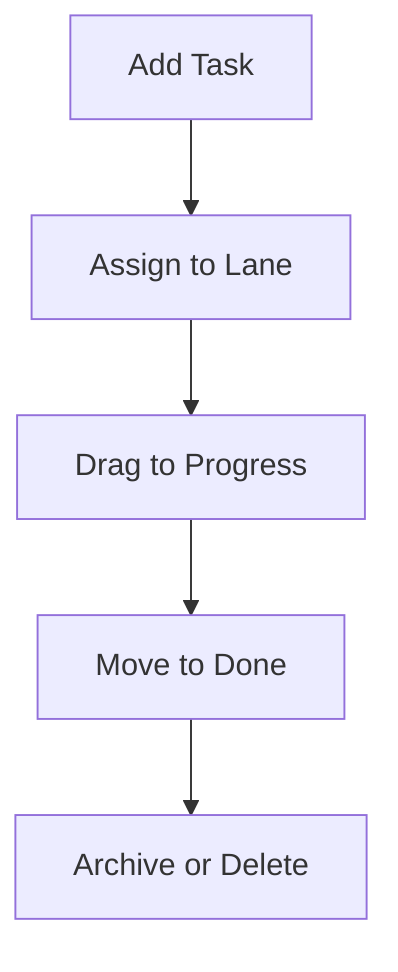

# 🧠 ReactKanbanBoard

A sleek, responsive Kanban board built with React for intuitive task management and agile workflow visualization. Whether you're sprint planning, backlog grooming, or organizing personal goals—this board makes productivity feel effortless.


---

## ✨ Features

- 🖱️ **Drag-and-drop lanes** for seamless task movement
- 🔄 **Dynamic task updates** with real-time UI refresh
- 📱 **Responsive design** for desktop and mobile
- 🧩 **Modular components** for easy customization
- 🧠 **Ideal for agile teams**, solo developers, and productivity nerds

---
## UI 
> 📌 A clean, responsive Kanban board UI with draggable tasks

## 📦 Tech Stack

| Frontend | State Management | Styling | Build Tools |
|----------|------------------|---------|-------------|
| React    | useState / useEffect | CSS     | Vite / Webpack |

---

## 🚀 Getting Started

### 1. Clone the repo

```bash
git clone https://github.com/Bhaveshpatil44/ReactKanbanBoard.git
cd ReactKanbanBoard
```

### 2. Install dependencies

```bash
npm install
```

### 3. Run the app

```bash
npm start
```

Open [http://localhost:3000](http://localhost:3000) to view it in your browser.

---

## 🧭 Workflow Overview

Here's how the board works:



---

## 🛠️ Folder Structure

```
ReactKanbanBoard/
├── public/
│   └── index.html
├── src/
│   ├── components/
│   │   ├── Board.jsx
│   │   ├── Lane.jsx
│   │   └── TaskCard.jsx
│   ├── App.jsx
│   └── index.js
├── package.json
└── README.md
```

---

## 🧪 Future Enhancements

- ✅ Add user authentication
- 📊 Integrate analytics dashboard
- 🔔 Push notifications for task updates
- 🗂️ Multi-board support

---

## 🤝 Contributing

Pull requests are welcome! For major changes, please open an issue first to discuss what you’d like to change.

```bash
git checkout -b feature/your-feature-name
git commit -m "Add your feature"
git push origin feature/your-feature-name
```


---

## 🙌 Author

Made with ❤️ by [Bhavesh Patil](https://github.com/Bhaveshpatil44)


